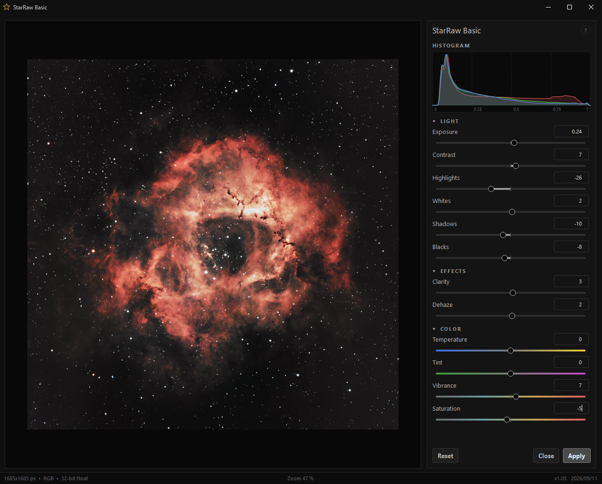

# StarRaw Basic

ACR **"Basic" panel** emulation for [Siril](https://siril.org) — a Python script with a live-preview PyQt6 GUI.

## Features

| Group | Sliders |
|-------|---------|
| **Light** | Exposure, Contrast, Highlights, Whites, Shadows, Blacks |
| **Effects** | Clarity, Dehaze |
| **Color** | Temperature, Tint, Vibrance, Saturation |

## Requirements

- Siril **1.3+** with Python scripting (`sirilpy`)
- Python packages: `PyQt6`, `numpy`, `opencv-python`
  (installed automatically via `sirilpy.ensure_installed` on first run)

## Installation

1. Copy `StarRaw_Basic.py` into your Siril scripts directory.
2. Restart Siril or refresh the script list.

## Usage

1. Open / load an image in Siril (RGB or mono, any bit depth).
2. Run **StarRaw Basic** from the Scripts menu. The current image is loaded automatically.
3. Adjust the sliders — the preview and histogram update in real time.
4. Press **Apply** to write the adjustment back to Siril (overwrites the loaded image, undo available).
5. **Close** exits without changes and resets Siril's display stretch (`visu 0 65535`).

### Controls

| Action | Effect |
|--------|--------|
| Mouse wheel over preview | Zoom in / out |
| Drag on preview | Pan |
| Double-click on preview | Fit to window |
| Hold **SPACE** | Show the original image; histogram and sliders temporarily revert to their defaults |
| Double-click a slider | Reset that slider |
| Mouse wheel over a slider | Step the value |
| **Reset** | All sliders to default |

## License

See `LICENSE`.
